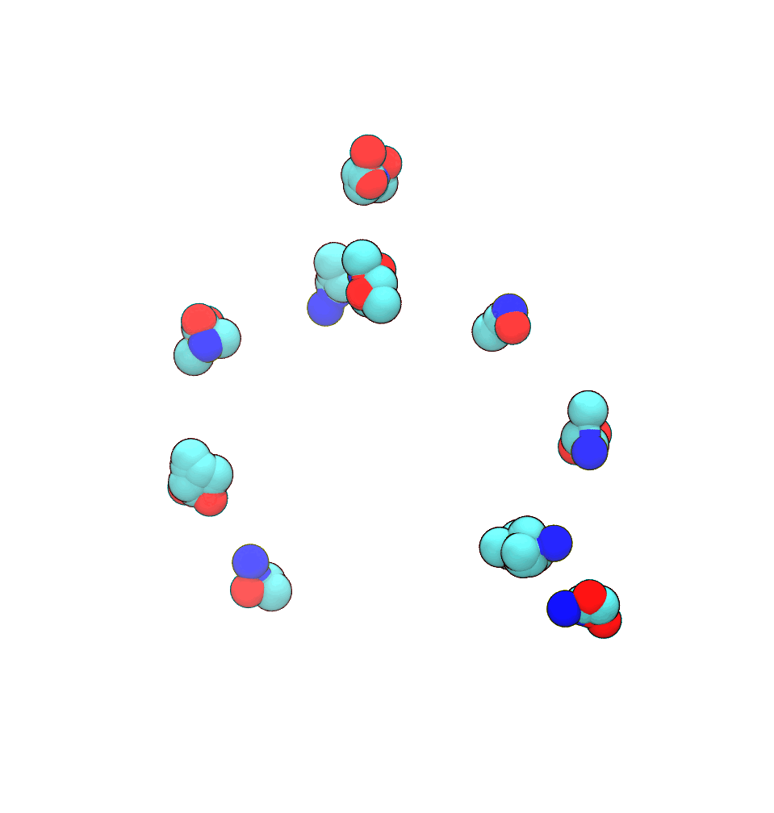

# Split-Flows: Measure Transport and Information Loss Across Molecular Resolutions

<div align="center">


[](https://codecov.io/gh/hummerichsander/split-flows)
[](https://opensource.org/licenses/MIT)
[](https://arxiv.org/abs/2511.01464)
[](https://github.com/astral-sh/ruff)

</div>

## Overview

Split-flows provide a probabilistic bridge between molecular resolutions, enabling conditional backmapping and direct measurement of the configuration-dependent (local) information loss.

<div align="center">
    
</div>

## Installation

Clone the repository and navigate to the project directory:

```bash
git clone git@github.com:hummerichsander/split-flows.git
cd split-flows
```

To install the project dependencies use uv (if you have not installed uv yet, check out the [uv documentation](https://docs.astral.sh/uv/getting-started/installation/)) and run:

```bash
uv sync
```

## Usage

### Training

Model training can be done using the [hydrantic package](https://github.com/hummerichsander/hydrantic), which bundles pytorch-lightning, hydra, and pydantic for model specification and training.

To let hydrantic know about the location of the configuration files you can set the environment variable `HYDRANTIC_CONFIG_PATH` to the path of the `config` directory.

Training a model can be done using the hydrantic command line interface. To train a model for alanine dipeptide (ala2.yml) run:

```bash
python -m hydrantic.cli.fit --config-name ala2
```

### Model loading

Weights and hyperparameters are stored as checkpoints (`.ckpt` files). To instantiate a model from a checkpoint, use the `load_from_checkpoint` method of the `Model` class:

```python
from split_flows.models import SplitFlow

model = SplitFlow.load_from_checkpoint(<checkpoint path>)
```

## Citation

If you use split-flows in your research, please cite:

```bibtex
@misc{hummerich2025splitflowsmeasuretransportinformation,
      title={Split-Flows: Measure Transport and Information Loss Across Molecular Resolutions},
      author={Sander Hummerich and Tristan Bereau and Ullrich Köthe},
      year={2025},
      eprint={2511.01464},
      archivePrefix={arXiv},
      primaryClass={physics.chem-ph},
      url={https://arxiv.org/abs/2511.01464},
}
```
