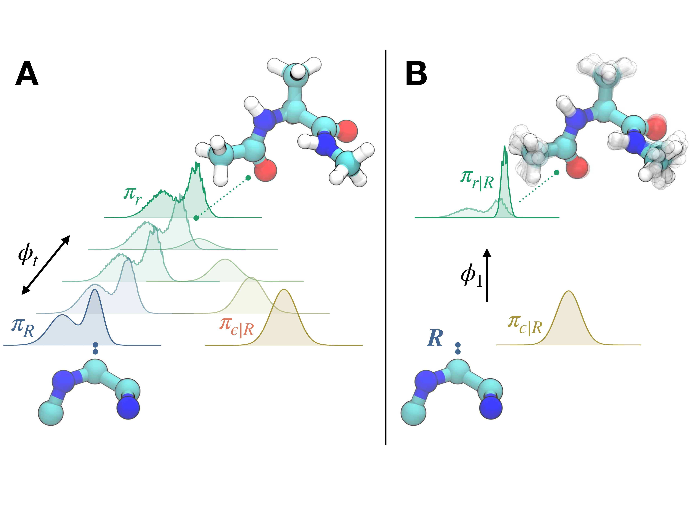

# Split-Flows: Measure Transport and Information Loss Across Molecular Resolutions

<div align="center">


[](https://codecov.io/gh/hummerichsander/split-flows)
[](https://opensource.org/licenses/MIT)
[](https://arxiv.org/abs/2511.01464)
[](https://github.com/astral-sh/ruff)

</div>

## Overview

Split-flows provide a probabilistic bridge between molecular resolutions, enabling conditional backmapping and direct measurement of the configuration-dependent (local) information loss.

<div align="center">
    
</div>

## Installation

Clone the repository and navigate to the project directory:

```bash
git clone git@github.com:hummerichsander/split-flows.git
cd split-flows
```

To install the project dependencies use uv (if you have not installed uv yet, check out the [uv documentation](https://docs.astral.sh/uv/getting-started/installation/)) and run:

```bash
uv sync
```
